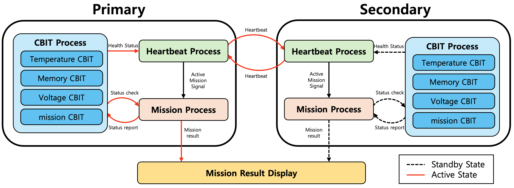
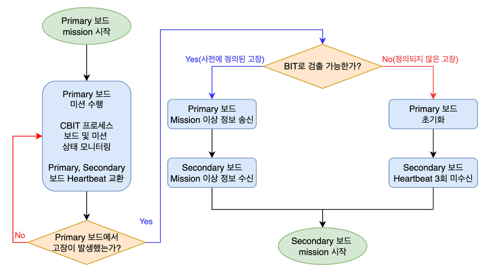
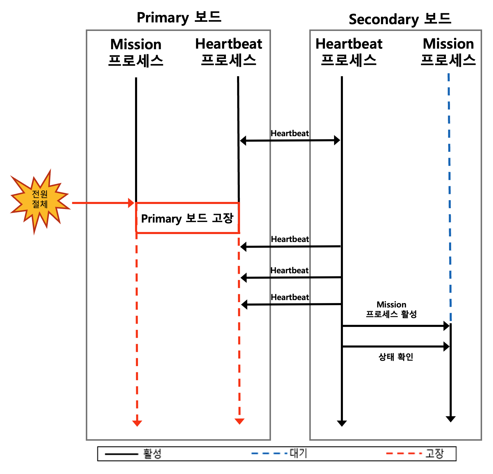
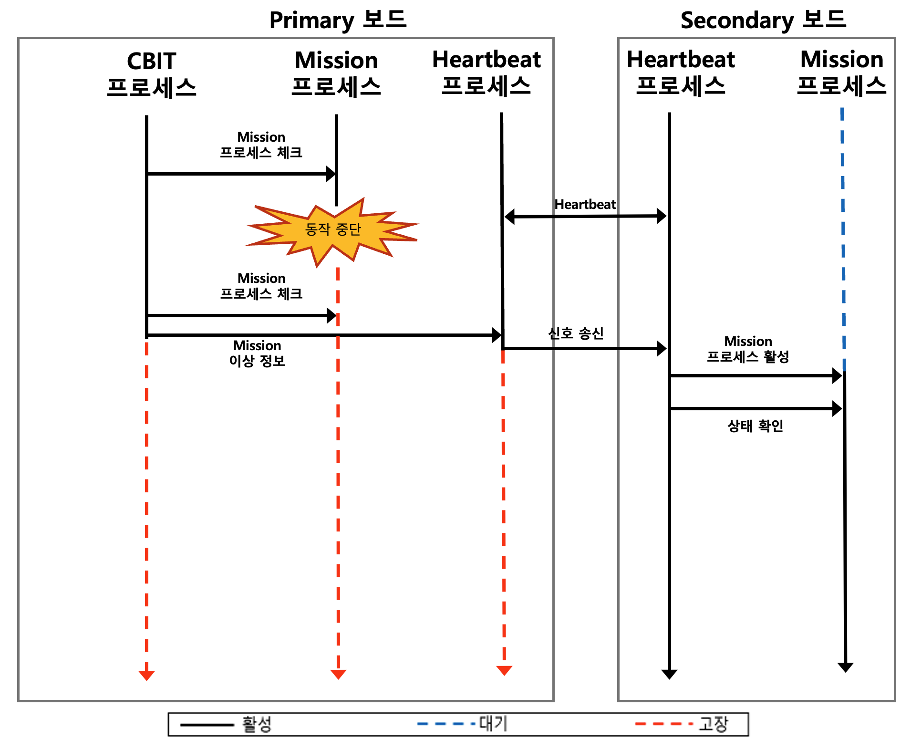
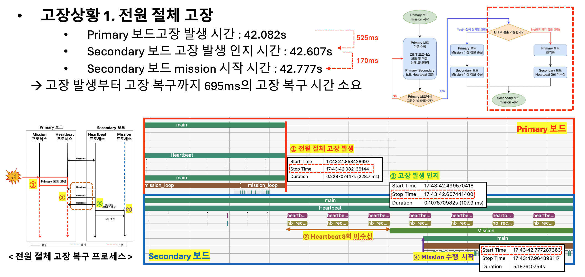
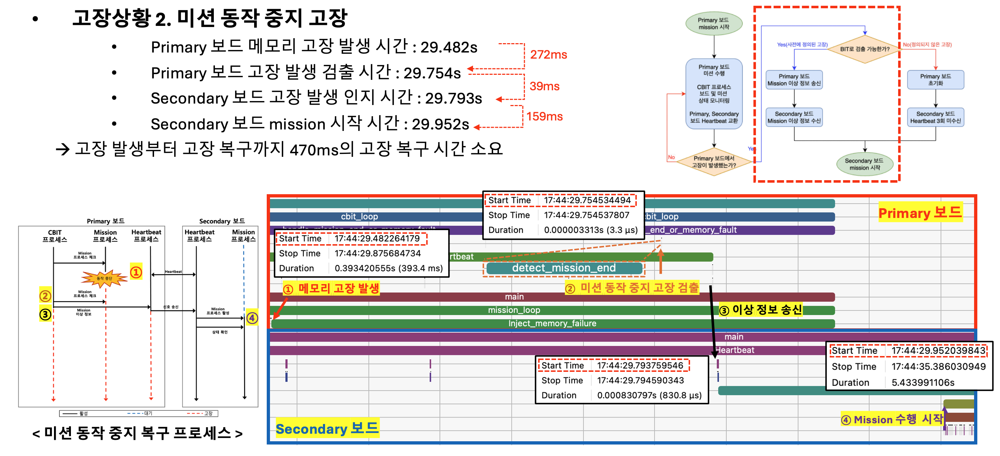

# DMR (Dual Modular Redundancy) System

Raspberry Pi 5 기반의 이중화 고장 감내 시스템 (Fault-Tolerant System)

드론 등 상용 보드 기반 시스템은 가격 경쟁력은 높지만 안전성·신뢰성이 취약합니다. 본 프로젝트는 두 대의 Raspberry Pi 5를 Primary/Secondary로 구성하여, **CBIT(Continuous Built-In Test)** 과 **Heartbeat** 기반의 이중 복구 메커니즘으로 고장 발생 시 Secondary 보드가 즉시 임무를 대체 수행하는 **Warm-Standby DMR** 시스템입니다.

> 사전에 정의된 고장(온도, 전압, 메모리 등)은 CBIT Alert을 통해 **기존 Heartbeat 방식 대비 평균 4배 빠른 복구**를 달성하였습니다.

## System Architecture

<p align="center">
  
</p>

### Core Processes

| Process | Role |
|---------|------|
| **Heartbeat** | 주기적으로 상대 보드에 상태 정보를 송수신하여 양 보드 간 상태를 동기화 |
| **CBIT** (Continuous Built-In Test) | 온도, 전압, 메모리, Mission 프로세스 상태를 모니터링하여 고장 탐지 |
| **Mission** | 실제 임무 수행 프로세스 (MiBench - basicmath_large) |

## Fault Recovery

고장 유형에 따라 두 가지 복구 방식으로 동작합니다.

<p align="center">
  
</p>

### 1. Heartbeat 기반 복구 (정의되지 않은 고장)

Primary 보드가 갑자기 멈추면 Heartbeat 신호가 중단됩니다.
Secondary는 **3회 연속 미수신** 시 고장으로 판단하고 임무를 대체 수행합니다.

<p align="center">
  
</p>

### 2. CBIT 기반 복구 (사전에 정의된 고장)

CBIT이 고장을 감지하면 **즉시** Alert 신호를 Heartbeat 메시지에 포함하여 전송합니다.
Secondary는 수신 즉시 임무를 대체 수행합니다.

<p align="center">
  
</p>

## Project Structure

```
DMR/
├── UART/                          # UART 통신 방식
│   ├── Primary/Primary.c          #   Primary 보드 코드
│   └── Secondary/Secondary.c      #   Secondary 보드 코드
├── UDP/                           # UDP 통신 방식
│   ├── Primary/Primary.c          #   Primary 보드 코드
│   └── Secondary/Secondary.c      #   Secondary 보드 코드
├── mission/                       # Mission 프로세스 (MiBench)
│   ├── Primary/basicmath/         #   Primary용 basicmath_large
│   └── Secondary/basicmath/       #   Secondary용 basicmath_large
└── docs/
    ├── lttng-guide.md             # LTTng 트레이싱 가이드
    └── trace-compass-guide.md     # Trace Compass 시각적 분석 가이드
```

## Hardware Setup

### Requirements

- Raspberry Pi 5 x 2 (Ubuntu 24.04)
- LAN Cable x 1 (UDP 통신용)
- GPIO Jumper Wire x 3 (UART 통신용)

### Wiring

- **UART**: GPIO 핀 교차 연결 (Primary TX↔Secondary RX, Primary RX↔Secondary TX, GND 공통)
- **UDP**: LAN 케이블로 두 보드 직접 연결

## Quick Start

### 1. 환경 설정 (양쪽 보드 공통)

```bash
# UART 설정 (/boot/firmware/config.txt 끝에 추가)
echo -e "[pi5]\ndtoverlay=uart0-pi5" | sudo tee -a /boot/firmware/config.txt
sudo reboot

# LTTng 설치
sudo apt update
sudo apt install -y lttng-tools lttng-modules-dkms liblttng-ust-dev
sudo apt install -y python3-setuptools python3-yaml
git clone https://github.com/tahini/lttng-utils.git
cd lttng-utils && sudo python3 setup.py install
```

### 2. 빌드

```bash
# Primary 보드
cd mission/Primary/basicmath && make
cp basicmath_large ../../UART/Primary/    # 또는 UDP/Primary/
cd UART/Primary
gcc Primary.c -g -O2 -finstrument-functions -w -o Primary

# Secondary 보드
cd mission/Secondary/basicmath && make
cp basicmath_large ../../UART/Secondary/  # 또는 UDP/Secondary/
cd UART/Secondary
gcc Secondary.c -g -O2 -finstrument-functions -w -o Secondary
```

### 3. 실행

```bash
# Primary 보드
sudo ./Primary <HB주기ms> <고장코드> -p basicmath_large
# 예시: sudo ./Primary 100 1 -p basicmath_large

# Secondary 보드
sudo ./Secondary <HB주기ms>
# 예시: sudo ./Secondary 100
```

### 4. 고장 주입 테스트

```bash
# 전원 절체 시뮬레이션 (Primary 보드에서)
sudo pkill Primary && sudo pkill basicmath_large
# → Secondary가 자동으로 mission을 이어서 수행
```

## Performance Results

Heartbeat 주기 10~200ms, 각 조건별 100회 결함 주입 시험 결과:

| Hardware | Protocol | Predefined Fault (ms) | Undefined Fault (ms) | Ratio |
|----------|----------|-----------------------|----------------------|-------|
| Raspberry Pi 5 | UART | 112.35 | 314.52 | **2.8x** |
| Raspberry Pi 5 | UDP | 52.93 | 306.84 | **5.8x** |
| Raspberry Pi 2 | UART | 110.50 | 307.57 | **2.8x** |
| Raspberry Pi 2 | UDP | 65.60 | 318.79 | **4.9x** |

CBIT 기반 복구(Predefined Fault)가 Heartbeat 기반 복구(Undefined Fault) 대비 **평균 4배 이상 빠른 복구 시간**을 보여줍니다. 이는 Heartbeat 방식이 3회 미수신을 대기하는 반면, CBIT은 고장 감지 즉시 Alert 신호를 전송하기 때문입니다.

## Tracing & Analysis

LTTng와 Trace Compass를 사용하여 고장 복구 과정을 시각적으로 분석할 수 있습니다. 기존의 단순 로그 분석으로는 시스템 전체의 동작 흐름을 직관적으로 파악하기 어렵기 때문에, 커널 및 사용자 수준 이벤트를 추적하는 LTTng와 시각화 도구인 Trace Compass를 결합한 **시각적 트레이싱 기법**을 적용하였습니다.

```bash
# LTTng 트레이싱과 함께 실행
sudo lttng-record-trace -p cyg_profile ./Primary 100 1 -p basicmath_large
```

아래는 Trace Compass Flame Chart를 통해 고장 복구 과정을 검증한 결과입니다.

**전원 절체 고장 (Heartbeat 기반 복구 - 695ms)**

<p align="center">
  
</p>

**미션 동작 중지 고장 (CBIT 기반 복구 - 470ms)**

<p align="center">
  
</p>

자세한 분석 방법은 다음 문서를 참고하세요:
- [LTTng Tracing Guide](docs/lttng-guide.md)
- [Trace Compass Analysis Guide](docs/trace-compass-guide.md)

## Tech Stack

| Category | Technology |
|----------|-----------|
| Language | C (POSIX Threads, UART/UDP Socket) |
| Hardware | Raspberry Pi 5 (ARM64, Ubuntu 24.04) |
| Communication | UART (GPIO, 115200bps) / UDP |
| Tracing | LTTng v2.13 |
| Analysis | Trace Compass |
| Benchmark | MiBench (basicmath_large) |

## Publications

- **한명석**, 김창현, 박경민, 나종화, "CBIT 및 Heartbeat 기반 고장 감내 시스템 설계", *한국항공우주학회 2025 춘계학술대회 (KSAS 2025 Spring Conference)*
- **한명석**, 나종화, "시각적 트레이싱 기법을 활용한 저비용 싱글 보드 컴퓨터 기반 이중화 시스템의 동작 흐름 검증 방법", *항공우주시스템공학회 2025 추계학술대회 (SASE 2025 Fall Conference)*
